# Design System

## Visual Architecture Overview

### Application Layout Structure

```mermaid
graph TB
    A[App] --> B[AppLayout]
    B --> C[SidebarNavigation]
    B --> D[Header]
    B --> E[MainContent]
    
    C --> C1[NavigationItem Dashboard]
    C --> C2[NavigationItem Clean]
    C --> C3[NavigationItem Optimize]
    C --> C4[NavigationItem Protect]
    C --> C5[NavigationItem Speed Up]
    C --> C6[NavigationItem Toolbox]
    C --> C7[SystemStatus]
    
    D --> D1[ThemeToggle]
    D --> D2[SettingsMenu]
    D --> D3[QuickActions]
    
    E --> E1[Dashboard]
    E --> E2[CleanModule]
    E --> E3[OptimizeModule]
    E --> E4[ProtectModule]
    E --> E5[SpeedUpModule]
    E --> E6[ToolboxModule]
    
    E1 --> E1A[HealthScoreGauge]
    E1 --> E1B[PerformanceGrid]
    E1 --> E1C[QuickActionsPanel]
    
    E2 --> E2A[ScanProgressPanel]
    E2 --> E2B[JunkFilesCard]
    E2 --> E2C[RegistryCleanerCard]
    
    E3 --> E3A[StartupManager]
    E3 --> E3B[RAMOptimizer]
    E3 --> E3C[InternetBooster]
    
    E4 --> E4A[SecurityStatusPanel]
    E4 --> E4B[MalwareScanner]
    E4 --> E4C[RealTimeProtection]
    
    E5 --> E5A[GameBooster]
    E5 --> E5B[ProcessManager]
    E5 --> E5C[PerformanceMonitor]
    
    E6 --> E6A[SoftwareUninstaller]
    E6 --> E6B[DriverUpdater]
    E6 --> E6C[FileTools]
```

## Component Architecture

### HealthScoreGauge Component Flow

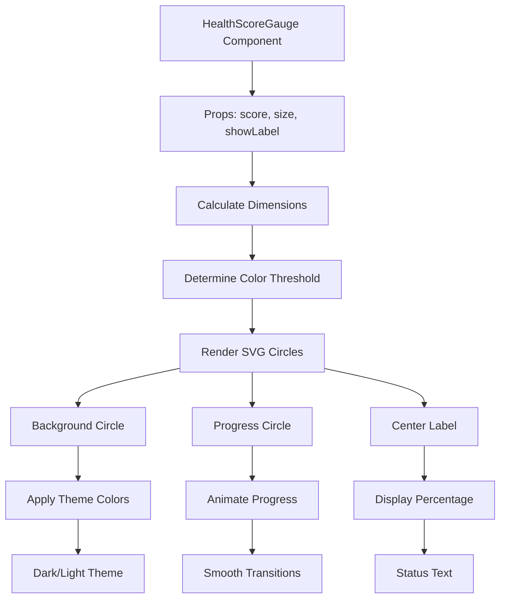

### State Management Flow

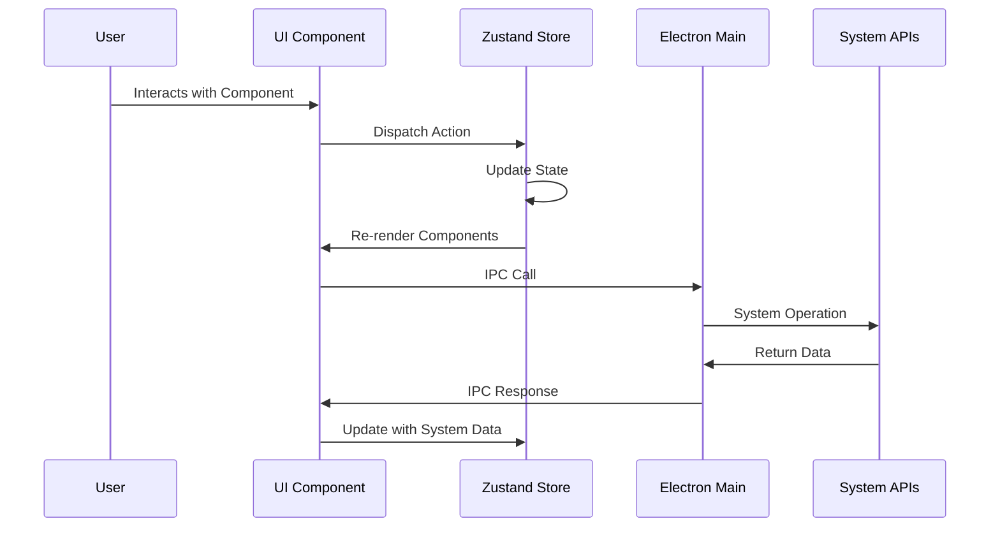

## Color System

### Primary Color Palette

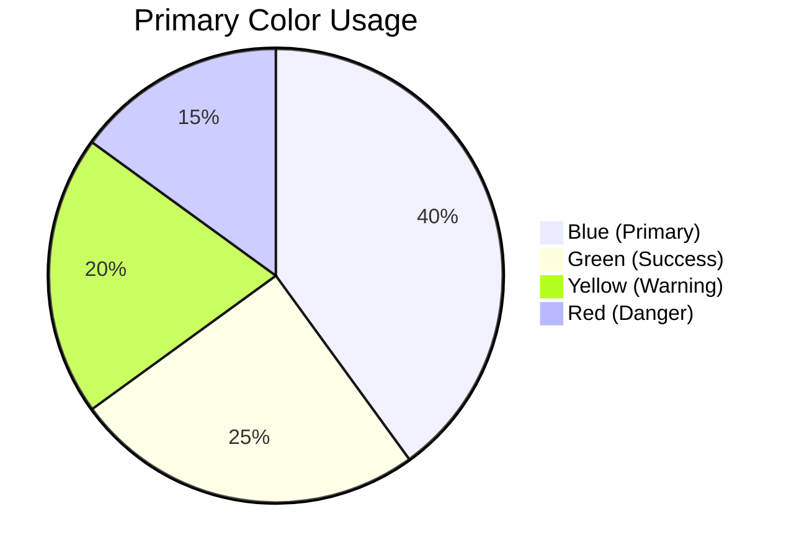

### Theme Color Mapping

| Component | Light Theme | Dark Theme | Usage |
|-----------|-------------|------------|-------|
| Background Primary | #FFFFFF | #0F172A | Main background |
| Background Secondary | #F8FAFC | #1E293B | Cards, panels |
| Text Primary | #1E293B | #F1F5F9 | Main text |
| Text Secondary | #64748B | #94A3B8 | Secondary text |
| Border | #E2E8F0 | #475569 | Borders, dividers |
| Primary | #3B82F6 | #3B82F6 | Buttons, links |
| Success | #22C55E | #22C55E | Positive states |
| Warning | #F59E0B | #F59E0B | Warnings |
| Danger | #EF4444 | #EF4444 | Errors, critical |

## Typography Scale

### Font Hierarchy

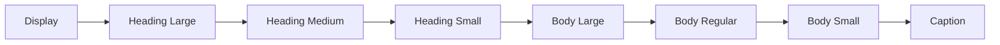

### Typography Specifications

| Level | Font Size | Font Weight | Line Height | Use Case |
|-------|-----------|-------------|-------------|----------|
| Display | 2.5rem (40px) | 700 | 1.2 | Main headings |
| Heading Large | 2rem (32px) | 600 | 1.3 | Section titles |
| Heading Medium | 1.5rem (24px) | 600 | 1.4 | Card titles |
| Heading Small | 1.25rem (20px) | 600 | 1.5 | Subheadings |
| Body Large | 1.125rem (18px) | 400 | 1.6 | Large body text |
| Body Regular | 1rem (16px) | 400 | 1.5 | Regular text |
| Body Small | 0.875rem (14px) | 400 | 1.4 | Small text, captions |
| Caption | 0.75rem (12px) | 400 | 1.3 | Labels, metadata |

## Spacing System

### Spacing Scale

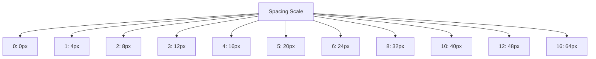

### Layout Spacing Guidelines

| Element | Padding | Margin | Usage |
|---------|---------|--------|-------|
| Container | 24px | 0 | Main content containers |
| Card | 24px | 16px | Feature cards |
| Button | 12px 24px | 8px | Interactive buttons |
| Input | 12px 16px | 8px | Form inputs |
| Section | 32px | 24px | Content sections |

## Component Specifications

### Button Variants

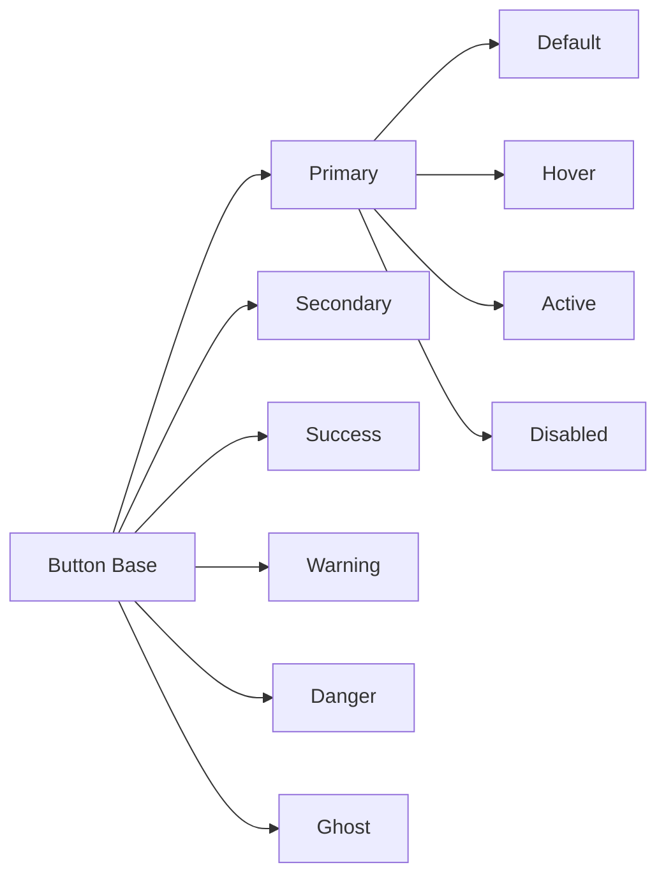

### Button States Table

| Variant | Background | Text | Border | Hover | Active |
|---------|------------|------|--------|-------|--------|
| Primary | Blue 500 | White | Blue 500 | Blue 600 | Blue 700 |
| Secondary | Gray 100 | Gray 800 | Gray 300 | Gray 200 | Gray 400 |
| Success | Green 500 | White | Green 500 | Green 600 | Green 700 |
| Warning | Yellow 500 | White | Yellow 500 | Yellow 600 | Yellow 700 |
| Danger | Red 500 | White | Red 500 | Red 600 | Red 700 |
| Ghost | Transparent | Gray 600 | Transparent | Gray 100 | Gray 200 |

### Card Component States

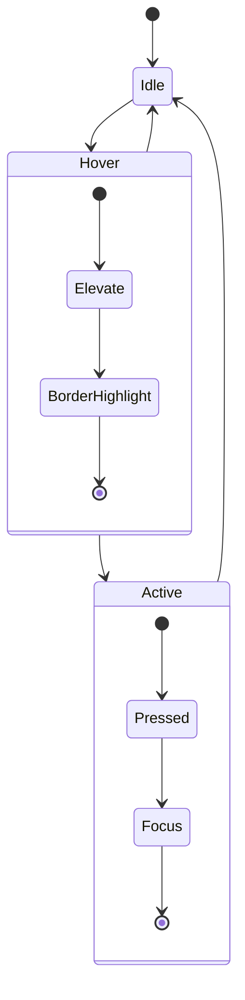

## Responsive Design

### Breakpoint System

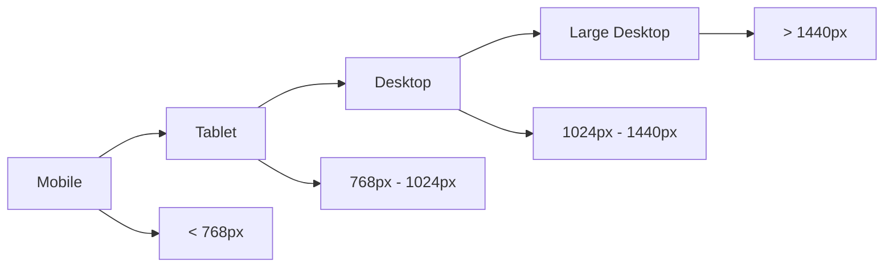

### Responsive Layout Patterns

| Component | Mobile | Tablet | Desktop | Large Desktop |
|-----------|--------|--------|---------|---------------|
| Sidebar | Hidden | Collapsed | Expanded | Expanded |
| Navigation | Bottom bar | Sidebar | Sidebar | Sidebar |
| Card Grid | 1 column | 2 columns | 3 columns | 4 columns |
| Charts | Full width | 1 per row | 2 per row | 3 per row |

## Animation System

### Motion Principles

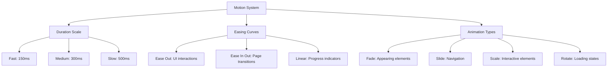

### Animation Specifications

| Element | Type | Duration | Easing | Use Case |
|---------|------|----------|--------|----------|
| Page Transition | Slide | 300ms | ease-in-out | Navigation |
| Modal Appearance | Fade + Scale | 200ms | ease-out | Dialog opening |
| Button Interaction | Scale | 150ms | ease-out | Button clicks |
| Progress Indicator | Linear | N/A | linear | Loading states |
| Health Score | Custom | 1000ms | ease-out | Score changes |

## Accessibility Guidelines

### WCAG Compliance

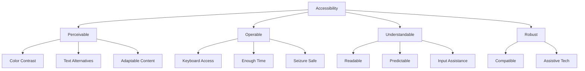

### Accessibility Specifications

| Requirement | Implementation | Target Level |
|-------------|----------------|--------------|
| Color Contrast | Minimum 4.5:1 ratio | AA |
| Keyboard Navigation | Full tab navigation | AAA |
| Screen Reader | ARIA labels and roles | AA |
| Focus Management | Logical focus order | AA |
| Text Resize | 200% without loss | AA |

This design system provides a comprehensive foundation for building a consistent, accessible, and visually appealing user interface for the Advanced SystemCare alternative.